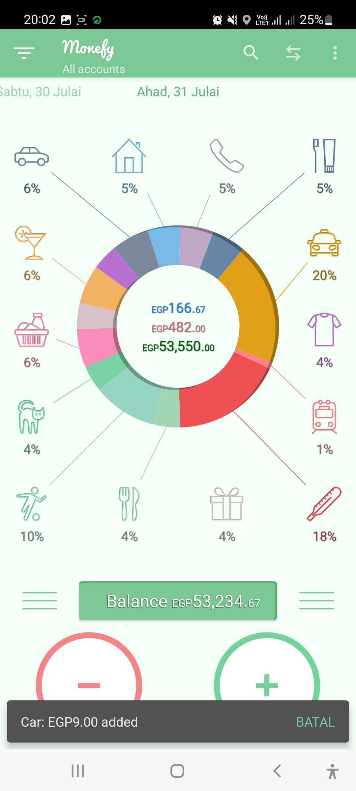

# InstaBug Challenge

### A- Test Design : test the andoid app Monefy
https://play.google.com/store/apps/details?id=com.monefy.app.lite

#### Deliverables:
1. Write down all needed high level scenarios( minimum 10 scenarios) to ensure good coverage with different approaches
   ( confirming requirements, negative scenarios). These High level scenarios should contain all details needed to cover this.
2. Write with the scenarios prioritization of such test cases according to their possible business impact.

> list of High level scenarios:

| title | priority |
|-------|----------|
| validate install the app on different devices with different android versions                  | high   |
| validate uninstall and re-install the app on different devices and android versions            | high   |
| validate app UI compatibility with different screen sizes(list all common screen sizes)        | high   |
| validate put app in background, and re-open it at the same state without issues                | high   |
| validate adding a new account using unsubscribed user                                          | high   |
| validate change the account currency using unsubscribed user                                   | high   |
| validate add new incomes using unsubscribed user                                               | high   |
| validate add new expenses using unsubscribed user                                              | high   |
| validate transfer action between accounts using unsubscribed user                              | high   |
| validate that balance being updated correctly according to changes made to income and expenses | high   |
| validate enable and disable budget mode and it's effect on the stored incomes and expenses     | high   |
| validate selecting view (day/week/month/year/all) will show the correct data in home page      | high   |
| validate change app language using unsubscribed user                                           | medium |
| validate app performance using wifi network and cellular data network                          | medium |
| validate app performance in case of a process being interrupted by a phone call                | medium |
| validate transfer action from account to the same account                                      | medium |
| validate app performance with low battery and power saving mode                                | low    |

---
### B- Bug Reporting

#### Deliverables:
1. Write down bugs you found with detailed reports (minimum 6 bugs to be found).
2. Mention(Title,ReproducibleSteps,Attachments,AffectedDevices,Network,Severity,Priority,Impact)
3. Make sure to vary in the types of the bugs found as QA Engineers don’t only work with developers, but also closely
   collaborate with Product Managers.It would be great if you have a strong product sense, you're welcome to spot any
   UX issues in this app and write it down.

> list of Bugs:

| title                                                                                                                                                                       | steps                                                                                                                                                                                 | attachments | devices                          | network                | severity | priority | impact                               |
|-----------------------------------------------------------------------------------------------------------------------------------------------------------------------------|---------------------------------------------------------------------------------------------------------------------------------------------------------------------------------------|-------------|----------------------------------|------------------------|----------|----------|--------------------------------------|
| change language does not change all app fields language                                                                                                                     | 1- open app 2- open side menu and select settings  3- change language from english to deutsch  4- open left side menu and right side menu  5- open right side menu  6- open transfer page | [![change-language]]({change-language.mp4} "Link Title")       | device : samsung A52 android :12 | - wifi  - cellular data | medium   | high     | high impact in UX                    |
| opening App without any internet connection causes an error message to appear                                                                                               | 1- close any internet connection on the mobile device  2- open the App                                                                                                                 | video       | device : samsung A52  android :12 | no internet connection | low      | medium   | low impact                           |
| add many expenses leads to get one icon not connected to it's part in the donut                                                                                             | 1- open App  2- add expenses to all categories   3- checkout all expenses icons                                                                                                         |        | device : samsung A52  android :12 | - wifi  - cellular data | low      | medium   | medium UX impact                     |
| while adding a note in add expense page, the system keyboard overlaps on the numeric keyboard and the first 3 digits in the numeric keyboard still accessable and clickable | 1- open App  2- choose any category to add expense to it  3- in add expense page add note                                                                                               | video       | device : samsung A52  android :12 | - wifi  - cellular data | medium   | high     | high impact in UX                    |
| merge two accounts results in wrong calculations                                                                                                                             | 1- opan App  2- create account A with balance 900  3- create account B with balance 99  4- merge account A to account B                                                                  | video       | device : samsung A52  android :12 | - wifi  - cellular data | high     | high     | high impact in functionality, and UX |
| user is able to make a transfer with amount more than the account balance, or even from an emppty account without even having any warning message                           | 1- open App  2- create account A with balance 10 EGP  3- create account B with balance 20 EGP  4- make a transfer from account A to account B with an amount equal to 500 EGP            | video       | device : samsung A52  android :12 | - wifi  - cellular data | high     | high     | high impact in functionality, and UX |
| unsubscribed user can not change currency from currency tab, but still able to change it from settings tab                                                                  | 1- open App  2- from side menu click on currency tab  3- close pro offer page  4- open settings tab change currency                                                                       | video       | device : samsung A52  android :12 | - wifi  - cellular data | high     | high     | high impact in functionality         |

---
### C- Test Automation

#### Deliverables:
1. Document Several detailed Test Cases to ensure good coverage by automation.
2. Implement automated tests based on the test cases from the previous step.

> list of automated test cases for google seach page:
1. validate google logo exists 
2. validate search bar exists
3. validate write and clear text in search bar
4. validate that suggestions list appears after enter text in search bar
5. validate search for a special keyword and expecting a result to appear first ex. instabug
6. validate search using empty keywords ex. (add single or multiple spaces then click search)
7. validate that pagination exists at the end of page in case of many results
8. validate that pagination is working 
9. validate search status (time and number of results)
10. search using multiple inputs with different criteria using a data provider ex.(very long input, special chars, meaningless keywords, numbers only)
